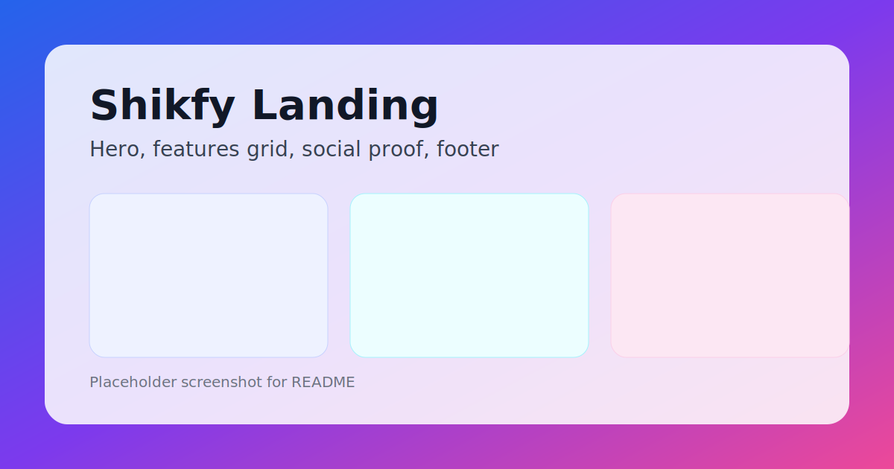
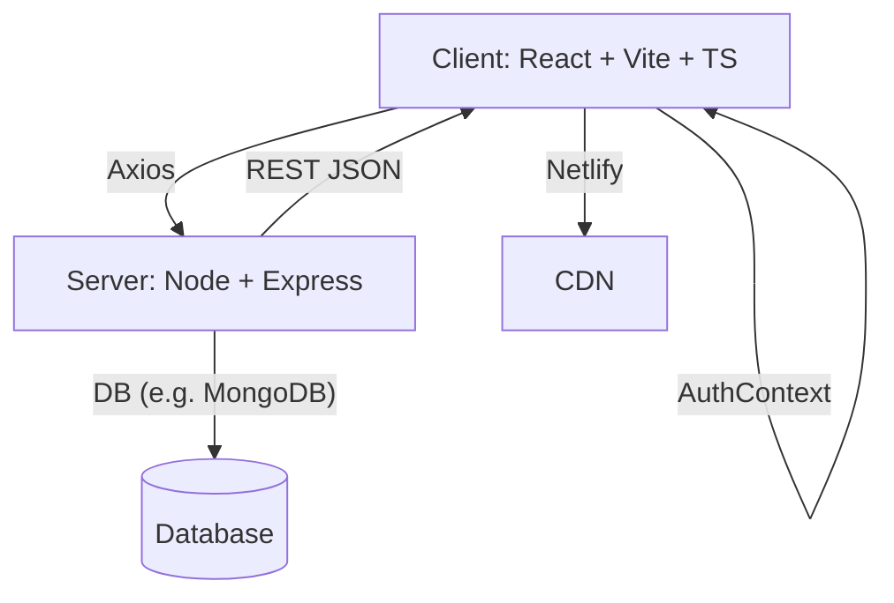
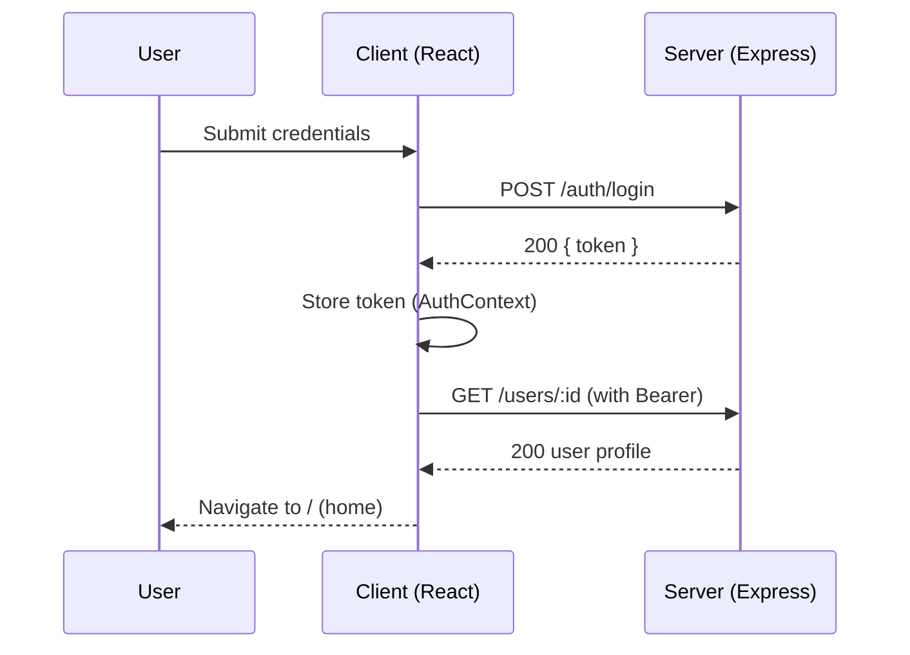

# Shikfy


A modern, full‑stack social platform focused on stories, reels, chat, and privacy‑first profiles. This repository contains a React (+ Vite) client and a Node.js/Express server, designed to be easily understood, run, and extended by engineering and product teams.

---

## 1) Quick Summary
- **What it is:** A creator‑centric social app with posts, reels, stories, chat, notifications, explore, bookmarks, and robust profile privacy.
- **Why it exists:** To provide a fast, beautiful, and privacy‑conscious experience where users share and connect through rich media and messaging.
- **How it’s built:** React (TypeScript) on the frontend, Node/Express on the backend, REST APIs, and Netlify‑friendly client deploys.

---

## 2) Top Capabilities
- **Authentication**
  - Email/password signup and login (`client/src/pages/Login.tsx`, `client/src/pages/Signup.tsx`)
  - Persistent session via `AuthContext` (`client/src/contexts/AuthContext.tsx`)
- **Profile**
  - Profile view with cover banner and avatar (`client/src/pages/Profile.tsx`)
  - Follow/unfollow, followers/following counts
  - Privacy: profile visibility (public/private), toggle follower/following list visibility
  - Close Friends management
- **Content**
  - Posts (grid), Reels (short‑video style), Mentions, Bookmarks/Saved (`client/src/pages/Saved.tsx`, `client/src/pages/Reels.tsx`)
  - Stories support (active story indicator)
- **Messaging & Presence**
  - Status message, auto‑reply toggle and text (`client/src/pages/Settings.tsx`)
- **Discovery & Engagement**
  - Explore page, Notifications page (`client/src/pages/Explore.tsx`, `client/src/pages/Notifications.tsx`)
  - Profile views list (user‑only)
- **Theming & UX**
  - System/light/dark themes via `ThemeContext`
  - Lucide icons, glassmorphism, gradients, responsive TailwindCSS UI

---

## 3) Repository Layout
```
Shikfy/
├─ client/                 # React + Vite frontend
│  ├─ src/
│  │  ├─ api/             # API client wrappers (Axios)
│  │  ├─ components/      # Reusable UI
│  │  ├─ contexts/        # Auth, Theme, etc.
│  │  ├─ pages/           # Route pages (Login, Signup, Landing, Profile, Settings, ...)
│  │  └─ main.tsx, App.tsx
│  ├─ index.html
│  └─ package.json
├─ server/                 # Node.js/Express backend (APIs)
├─ netlify.toml            # Netlify deploy configuration for client
└─ README.md               # You are here
```

---

## 3.1) Screenshots
- **Landing preview**: `docs/images/landing.svg`



---

## 4) Architecture Overview
- **Client (React + TypeScript + Vite)**
  - Responsible for UI, state management (React hooks/contexts), and calling REST APIs via `apiClient`.
  - Route pages under `client/src/pages/` implement features.
  - Styling: TailwindCSS utility classes for consistent theming.
- **Server (Node.js + Express)**
  - Exposes REST endpoints for users, auth, posts, reels, stories, follow/following, bookmarks, notifications, privacy settings, and profile views.
  - JSON responses are consumed by the client via Axios (`client/src/api/client.ts`).
- **Deployment**
  - Client can be deployed on Netlify (configured by `netlify.toml`).
  - Server can be deployed to any Node‑friendly host (Render/Heroku/Vercel functions, etc.).

---

## 5) Key User Flows (End‑to‑End)
- **Sign up / Log in**
  - User creates an account or logs in from `Signup`/`Login` pages.
  - `AuthContext` stores session and injects auth headers into API calls.
- **View Profile**
  - `Profile.tsx` fetches user, posts, reels, follow status, and stories.
  - Users can follow/unfollow, view counts, open Edit Profile, see active story badge.
- **Manage Privacy**
  - In `Settings.tsx`, user sets profile visibility (public/private) and toggles whether follower/following lists are visible.
  - Close Friends list can be edited from following.
- **Content Tabs**
  - Posts/Reels/Mentions/Saved tabs fetch per‑tab content via backed endpoints.
- **Messaging prefs**
  - Users can set status and auto‑reply message in `Settings.tsx` which are used by chat features.
- **Explore & Notifications**
  - Explore: discover content; Notifications: view alerts and updates.

---

## 6) APIs (High‑Level Examples)
The server exposes REST endpoints similar to:
- `GET /users/:id` – profile details
- `GET /users/:id/posts` – user’s posts
- `GET /users/:id/reels` – user’s reels
- `GET /users/:id/following-status` – whether current user follows :id
- `POST /users/:id/follow` / `DELETE /users/:id/follow` – toggle follow
- `GET /bookmarks` – current user’s saved posts/reels
- `GET /stories/user/:id` – user’s stories
- `PATCH /users/:id/close-friends` – manage Close Friends

Exact request/response contracts live in the server code under `server/`. The client calls these via `apiClient` and guards data with `Array.isArray` checks and null‑safety.

### 6.1) Postman Collection
- Import: `docs/postman/Shikfy.postman_collection.json`
- Set variable `baseUrl` (default `http://localhost:3000`).

### 6.2) Detailed Contracts

1) GET `/users/:id`

Request:
```
GET /users/64a1...
Authorization: Bearer <token>
```
Response 200:
```json
{
  "_id": "64a1...",
  "username": "jane",
  "displayName": "Jane Doe",
  "profilePic": "https://.../avatar.jpg",
  "verified": true,
  "followersCount": 120,
  "followingCount": 80,
  "postsCount": 34,
  "privacySettings": {
    "profileVisibility": "public",
    "showFollowersList": true,
    "showFollowingList": true
  }
}
```

2) GET `/users/:id/posts`

Response 200:
```json
[{ "_id": "p1", "imageUrl": "https://...", "caption": "Hello" }]
```

3) GET `/users/:id/reels`

Response 200:
```json
[{ "_id": "r1", "videoUrl": "https://...", "cover": "https://..." }]
```

4) GET `/users/:id/following-status`

Response 200:
```json
{ "following": true }
```

5) POST `/users/:id/follow` and DELETE `/users/:id/follow`

Response 200:
```json
{ "ok": true }
```

6) GET `/bookmarks`

Response 200:
```json
{ "posts": [], "reels": [] }
```

7) GET `/stories/user/:id`

Response 200:
```json
[{ "_id": "s1", "media": "https://...", "createdAt": "2025-10-11T10:00:00Z" }]
```

8) PATCH `/users/:id/close-friends`

Request body:
```json
{ "userIds": ["64a1...", "64b2..."] }
```
Response 200:
```json
{ "updated": true }
```

---

## 7) Local Development

### Prerequisites
- Node.js 18+
- PNPM/Yarn/NPM (any)

### 7.1 Client (React)
```bash
# from repo root
cd client
npm install
npm run dev      # Vite dev server (by default http://localhost:5173)
```
Environment variables (create `client/.env`):
```
VITE_API_BASE_URL=http://localhost:3000
```

### 7.2 Server (Node/Express)
```bash
# from repo root
cd server
npm install
npm run dev      # or npm start, depending on scripts defined
```
Common environment variables (create `server/.env`):
```
PORT=3000
MONGODB_URI=your_mongodb_connection_string
JWT_SECRET=your_secret
CLIENT_ORIGIN=http://localhost:5173
```

---

## 8) Build & Deploy
- **Client**
  - Build: `cd client && npm run build`
  - Output: `client/dist/`
  - Netlify: `netlify.toml` routes SPA traffic to `index.html`.
- **Server**
  - Ensure environment variables are set in your hosting provider.
  - Run with a Node 18+ runtime. Configure CORS to allow the client origin.

---

## 9) Security, Privacy, and Compliance
- **Auth & Sessions**: Handled via server-issued tokens; client stores session via context. Protects private routes and user operations.
- **Privacy Controls**: Users control profile visibility and whether follower/following lists are shown.
- **Least Privilege**: Endpoints check user identity/authorization server-side.
- **PII**: Avoid logging sensitive data. Use HTTPS in production.

---

## 10) Performance & UX
- **Client**: Vite dev build speed, code-splitting by routes, memoized lists where applicable.
- **API**: Batched fetches where possible; optimistic updates (e.g., follow/unfollow) for responsiveness.
- **Accessibility**: Semantic components and focus states from Tailwind; ensure alt text for images.

---

## 11) Testing & Quality
- Unit/Integration tests can be added with Jest/RTL for client and Jest/Supertest for server.
- Linting: ESLint + TypeScript; formatting via Prettier.

Suggested scripts:
```json
{
  "scripts": {
    "lint": "eslint .",
    "format": "prettier --write ."
  }
}
```

---

## 12) Troubleshooting
- **Client can’t reach API**: Verify `VITE_API_BASE_URL`, CORS on server, and correct port.
- **Blank pages**: Check console for TypeScript errors; ensure `npm run dev` is running for both client and server.
- **Auth fails**: Confirm JWT secret/env vars and that server issues/validates tokens.

---

## 13) Roadmap Ideas
- Real-time chat with WebSocket/Socket.IO
- Rich story editor, reel effects, and audio
- Advanced privacy: per‑post audience presets
- Analytics dashboards for creators
- Push notifications (Web Push/FCM)

---

## 14) Contact & Handoff Notes
- This README is written for engineering/product/HR reviewers to quickly understand scope and architecture.
- For a live demo, deploy the client to Netlify (uses `netlify.toml`) and host the server on Render/Heroku. Configure `VITE_API_BASE_URL` to point to the server.

---

## Appendix A) Tech Stack Diagram



## Appendix B) Login flow (Sequence)


